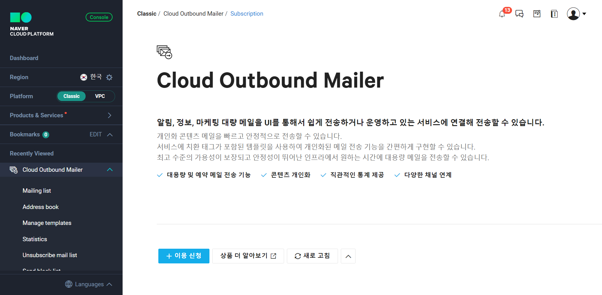
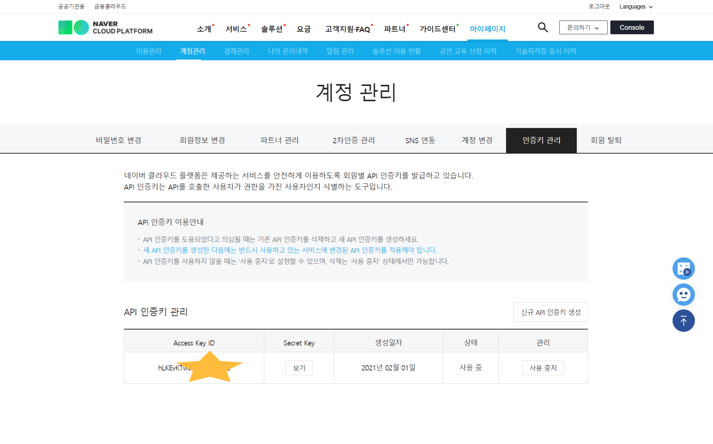
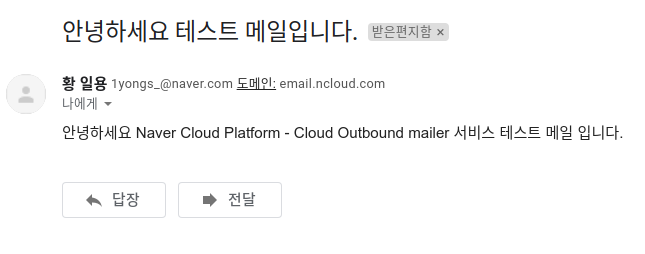

# NestJS 메일 발송 Dynamic Module

NestJS Dynamic Module을 이용하여 Naver Cloud Platform 메일 발송 ✉ 서비스 모듈 예제를 만들어 봅니다.

## Index

- Dynamic Module 이란,
- 설정
- 코드
- 느낀점

<hr>

## Dynamic Module 이란

### Module이란

NestJS에서 `Module`은 애플리케이션 구조를 구성(organize)하는데 사용됩니다.
NestJS의 모듈은 기본적으로 싱글톤 패턴입니다. 같은 프로바이더 인스턴스(Service, Gateway, ...)를 많은 모듈에서 쉽게 공유되어 사용할 수 있습니다.
NestJS의 `Module`은 전체 Application의 모듈형 부분으로, 적합한 Providers 및 Controllers와 같은 구성요소 그룹을 정의합니다.
NestJS 모듈은 1) 정적 모듈과 2) 동적 모듈 두 가지로 분류됩니다.

<br>

### 정적모듈

정적 모듈은 NestJS가 필요한 모든 정보를 미리 호스트 및 consuming 모듈에서 선언하여 사용합니다.

<br>

### 동적모듈

동적 모듈은 모듈 등록과 Provider를 동적으로 설정이 가능한 커스텀 가능한 모듈을 쉽게 만들 수 있게 합니다.

정적 모듈 바인딩에서 불가능했던 상황들이 있습니다. 개발환경에 맞춰 서버 포트번호를 다르게 부여해야하는 등 다양한 상황에서 동적 바인딩은 말그대로 **동적**으로 상황에 맞게 Module을 커스텀할 수 있게 해줍니다.

<hr>

## Example

우리의 예제에서는 메일 발송을 위한 모듈을 만들어 볼 것 입니다. API Key를 발급받아 환경변수에 설정하고, 이에 맞춰 Module을 동적으로 설정해봅시다.

### TODO List 📋

- [x] Naver Cloud Platform - Cloud Outbound Mailer API 발급
- [x] Set up NestJS Mail Module
  - [x] install package
  - [x] Configure Enviornment Variables
  - [x] Make Dynamic Module
  - [] Mail Service
- [] Test

<br>

#### 1. Naver Cloud Platform - Cloud Outbound Mailer API 발급

- Naver Cloud Platform에 접속하여 Cloud Out bound Mailer 이용신청을 합니다.
  
- `마이페이지` - `인증키 관리` 로 API 인증키를 발급합니다.
  

#### 2.Set up NestJS Mail Module

- `@nestjs/cli` 페키지를 설치하여 프로젝트를 생성해줍니다.
  ```sh
  $ npm i -g @nestjs/cli
  $ nest new mail-service-project
  $ npm i
  ```
- Mail module 하나를 생성해줍니다.
  ```sh
  $ nest generate module mail
  ```

#### 3.install package

- Cloud Outbound Mailer API 서비스는 RESTful 형태로 제공되기 때문에, `axios` package를 설치하여 api를 요청해봅니다.
  ```sh
  $ npm i axios # 다른 http package를 써도 됩니다.
  ```
- 또한 발급받은 API키를 환경변수로 사용하기 위해 `ConfigModule`를 설치하고, `Joi` data validator를 사용합니다. ([Joi](https://www.npmjs.com/package/joi)는 Config와 써보고 싶었는데, 이번에 같이 사용해보겠습니다.)
  ```sh
  $ npm i --save @nestjs/config
  $ npm i joi
  ```

#### 4.Configure Enviornment Variables

- 환경 변수를 설정해줄 `.env` 파일을 `package.json` 파일이 있는 디렉토리에 생성해줍니다.

  ```env
  # .env

  # NAVER CLOUD PLATFORM
  ACCESS_KEY_ID=퍼블릭키
  SECRET_KEY=쉿!비밀키ㅎ
  SENDER_ADDRESS=1yongs_@naver.com
  MAIL_API_DOMAIN=https://mail.apigw.ntruss.com/
  ```

- `app.module.ts`에 `ConfigModule`을 `.forRoot()` static method를 통해 root로 import 해줍니다. ([공식문서](https://docs.nestjs.com/techniques/configuration#service))

  ```ts
  // src/app.module.ts
  import { Module } from '@nestjs/common';
  import { ConfigModule } from '@nestjs/config';
  import { AppController } from './app.controller';
  import { AppService } from './app.service';
  import * as Joi from 'joi';

  @Module({
    imports: [
      ConfigModule.forRoot({
        isGlobal: true,
        envFilePath: `.env`,
        validationSchema: Joi.object({
          ACCESS_KEY_ID: Joi.string().required(),
          SECRET_KEY: Joi.string().required(),
          SENDER_ADDRESS: Joi.string().required(),
          MAIL_API_DOMAIN: Joi.string().required(),
        }),
      }),
    ],
    controllers: [AppController],
    providers: [AppService],
  })
  export class AppModule {}
  ```

#### 5. Make Dynamic Module

다음으로 Dynamic Module을 만들어 봅시다.

- Module을 만들기 전에, Mail Module을 Dynamic하게 만들어 주게해 줄 Module Option을 정의해봅시다. ([Custom Provider](https://docs.nestjs.com/fundamentals/custom-providers)는 시간이 되면 리뷰를 하겠습니다.)

  ```ts
  // src/common/common.constants.ts

  export const CONFIG_OPTIONS = 'CONFIG_OPTIONS';
  ```

  `CONFIG_OPTIONS`변수는 목적(모듈 설정 옵션이라는..)을 상술하기 위한 DI 토큰으로 쓰기위해 상수로 정의하였습니다.

  ```ts
  // src/mail/mail.interface.ts

  export interface MailModuleOptions {
    apiKey: string; // 네이버 클라우드 플랫폼 포털에서 발급받은 Access Key ID 값
    secret: string; // Access Key ID 값 과 Secret Key 로 암호화한 서명
    senderAddress: string; // 발송자 Email 주소. 임의의 도메인 주소 사용하셔도 됩니다만, 가능하면 발신자 소유의 도메인 Email 계정을 사용하실 것을 권고드립니다.
    language: string; // API 응답 값의 다국어 처리를 위한 값. (입력 값 예시: ko-KR, en-US, zh-CN, 기본 값:en-US)
  }
  ```

  `MailModuleOptions` 인터페이스를 만들어 사용할 옵션의 틀을 만들어줍니다.

<br>

- MailModule

  ```ts
  // src/mail/mail.module.ts

  import { DynamicModule, Module } from '@nestjs/common';
  import { CONFIG_OPTIONS } from 'src/common/common.constants';
  import { MailModuleOptions } from './mail.interface';

  @Module({})
  export class MailModule {
    static forRoot(options: MailModuleOptions): DynamicModule {
      return {
        module: MailModule,
        providers: [
          {
            provide: CONFIG_OPTIONS,
            useValue: options,
          },
        ],
        exports: [],
      };
    }
  }
  ```

  드디어 대망의 `MailModule` 입니다.

  1. MailModule을 Dynamic Module로 만들어 주기 위해 `DynamicModule` static method 인 `forRoot`를 정의 해줍니다.

  2. `forRoot`에 옵션을 주기위해 `options`를 매개변수로 주고,

  3. DynamicModule을 return 해주는데, `providers`를 유심히 살펴봅시다.

  4. 옵션 값(`options`)을 Depedency Inject하기 위해 `CONFIG_OPTIONS`을 `provide`에 DI token 값으로 주고, 매개변수 `options`를 useValue에 주면 Dynamic Module를 정의할 수 있습니다.
     <br>

- AppModule에 DynamicModule을 import해줍시다!
  ```ts
  // src/app.module.ts
    ...
      MailModule.forRoot({
        apiKey: process.env.ACCESS_KEY_ID,
        secret: process.env.SECRET_KEY,
        senderAddress: process.env.SENDER_ADDRESS,
        language: 'ko-KR', // 한국어
      }),
    ...
  ```

#### 6. Make Mail Service

- Service를 generate 해줍시다.
  ```sh
  $ nest generate service mail # windows는 npx nest generate service mail
  ```
- DTO들을 만들어 줍니다.
  메일을 발송하기 위해 Request / Response DTO를 만들어 줍니다.

  ```ts
  // src/mail/dto/send-email.dto.ts

  import { Type } from 'class-transformer';
  import { IsOptional, IsString, ValidateNested } from 'class-validator';
  import { CommonResponseDto } from 'src/common/dto/common.dto';

  export class Recipients {
    @IsString()
    address: string;
    @IsString()
    name: string;
    @IsString()
    type: string;
  }

  export class SendEmailRequestDto {
    @IsString()
    senderName: string;
    @IsString()
    title: string;
    @IsString()
    body: string;
    @ValidateNested({ each: true })
    @Type(() => Recipients)
    recipients: Recipients[];
  }

  export class SendEmailResponseDto extends CommonResponseDto {
    @IsOptional()
    @IsString()
    requestId?: string;
    @IsOptional()
    @IsString()
    count?: number;
  }
  ```

  <br>

  ```ts
  // src/common/dto/common.dto.ts
  import { IsBoolean, IsOptional, IsString } from 'class-validator';

  export class CommonResponseDto {
    @IsBoolean()
    status: boolean;
    @IsOptional()
    @IsString()
    error?: string;
    @IsOptional()
    @IsString()
    message?: string;
  }
  ```

- MailService

  메일을 발송하는데 api url로 POST 방식으로 전송합니다. 이때 headers에는 Cloud Outbound Mailer에 기재된 내용들을 넣어주고, 필요한 Body Data를 넣어 전송합니다.

  `x-ncp-apigw-signature-v2`는 Secret Key로 HmacSHA256 알고리즘으로 암호화한 후 Base64로 인코딩하여 담아 줍니다.

  ```ts
  import { Inject, Injectable } from '@nestjs/common';
  import axios from 'axios';
  import { createHmac } from 'crypto';
  import { CONFIG_OPTIONS } from 'src/common/common.constants';
  import {
    SendEmailRequestDto,
    SendEmailResponseDto,
  } from './dto/send-email.dto';
  import { MailModuleOptions } from './mail.interface';

  @Injectable()
  export class MailService {
    constructor(
      @Inject(CONFIG_OPTIONS) private readonly options: MailModuleOptions,
    ) {}

    async sendEmail(
      reqData: SendEmailRequestDto,
    ): Promise<SendEmailResponseDto> {
      const url = `/api/v1/mails`;
      const method = `POST`;
      try {
        const { data } = await axios.post<{ requestId: string; count: number }>(
          `${process.env.MAIL_API_DOMAIN}${url}`,
          {
            senderAddress: this.options.senderAddress,
            ...reqData,
          },
          {
            headers: {
              'Content-Type': 'application/json',
              'x-ncp-apigw-timestamp': new Date().getTime().toString(10),
              'x-ncp-iam-access-key': this.options.apiKey,
              'x-ncp-apigw-signature-v2': this.makeSignature(
                method,
                url,
                new Date().getTime().toString(),
                this.options.apiKey,
                this.options.secret,
              ),
              'x-ncp-lang': this.options.language,
            },
          },
        );

        return {
          ...data,
          status: true,
        };
      } catch (error) {
        console.log(error);
        return {
          status: false,
          error: error.response.data,
          message: `메일 발송에 실패하였습니다.`,
        };
      }
    }

    private makeSignature(
      method: string,
      url: string,
      timestamp: string,
      accessKey: string,
      secretKey: string,
    ): string {
      const space = ' '; // 공백
      const newLine = '\n'; // 줄바꿈

      const hmac = createHmac('sha256', secretKey);

      hmac.write(method);
      hmac.write(space);
      hmac.write(url);
      hmac.write(newLine);
      hmac.write(timestamp);
      hmac.write(newLine);
      hmac.write(accessKey);

      hmac.end();

      return Buffer.from(hmac.read()).toString('base64');
    }
  }
  ```

#### 7. Test

- AppController

  메일 발송을 위한 endpoint를 `app.controller.ts`에 열어줍시다.

  ```ts
  // src/app.controller.ts

  @Controller()
  export class AppController {
    constructor(private readonly mailService: MailService) {}

    @Post('/mail')
    sendToClient(
      @Body() reqData: SendEmailRequestDto,
    ): Promise<SendEmailResponseDto> {
      return this.mailService.sendEmail(reqData);
    }
  }
  ```

- Request

  ```ts
  // request url
  "http://localhost:3000/mail"

  // post request body
  {
    "senderName": "황 일용",
    "title": "안녕하세요 테스트 메일입니다.",
    "body": "안녕하세요 Naver Cloud Platform - Cloud Outbound mailer 서비스 테스트 메일 입니다. ",
    "recipients": [
      {
        "address": "iyhwang@hnmcorp.kr",
        "name": "황일용",
        "type": "R"
      }
    ]
  }
  ```

- Response

  ```ts
  // response
  {
    "requestId": "20210203000054051502",
    "count": 1,
    "status": true
  }
  ```

  

<br>

### 8. 느낀점

Dynamic Module를 적용해봄으로써 NestJS 프레임워크의 `IoC`, `DI`에 대한 이해에 도움이 많이 되었습니다. 다음번엔 `Custom Provider`를 리뷰를 해보도록 하겠습니다.

Custom Provider 부분에서 Factory function과 Dependency Injection에 대한 이야기를 깊이 있게 다뤄보겠습니다.
